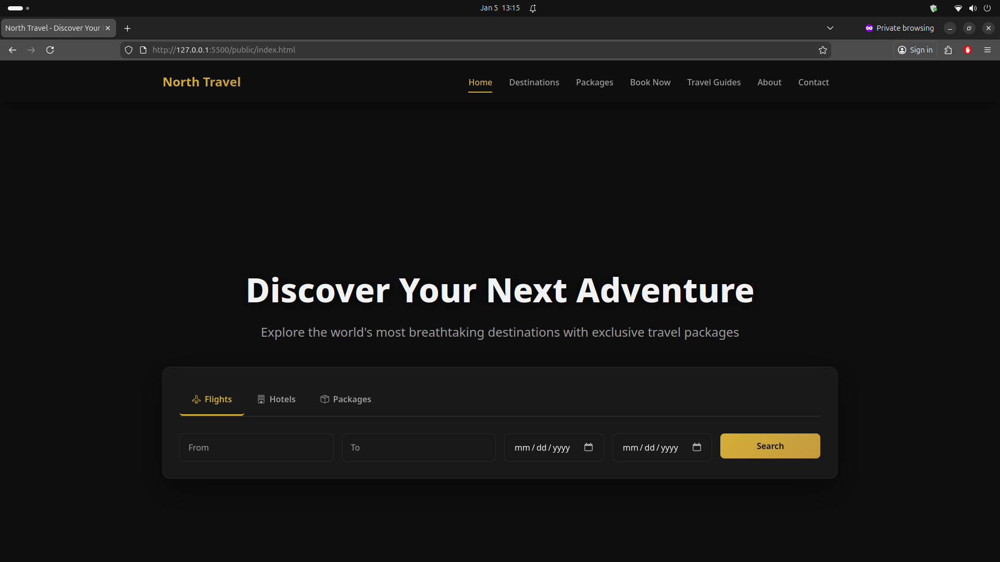

# ✈️ NorthTravel – Modern Travel & Booking Platform



---

## 🚀 Features  

- **User Authentication**  
  Secure user registration, login, email verification, password change, and account deletion.  

- **Travel Booking System**  
  Browse destinations, select packages, and manage bookings through a clean API.  

- **Shopping Cart & Checkout**  
  Add travel packages to cart, review selections, and complete checkout smoothly.  

- **Missions & Rewards System**  
  Users can complete missions, earn points, and claim rewards to boost engagement.  

- **User Dashboard**  
  Centralized dashboard for bookings, rewards, points, and account settings.  

- **RESTful API Architecture**  
  Modular PHP API structure for scalability and easy maintenance.  

- **Responsive Frontend**  
  Clean, responsive HTML/CSS/JS frontend optimized for desktop and mobile.  

- **Separation of Concerns**  
  Clear separation between backend API (`/api`) and frontend (`/public`).  

---


## 🛠 Tech Stack

### Backend
- **Language:**  
  - [PHP](https://www.php.net/) – REST API & business logic  

- **Database:**  
  - MySQL / MariaDB  

- **Architecture:**  
  - Modular RESTful endpoints  
  - Centralized configuration and helpers  

---


### Frontend
- **Languages:**  
  - HTML5  
  - CSS3  
  - JavaScript (Vanilla)  

- **Pages:**  
  - Landing, Destinations, Packages  
  - Booking, Cart, Dashboard  
  - Authentication & Settings  


---

## ⚡ Usage

1. **Clone the repository:**

   ```
   git clone https://github.com/m223rx/NorthTravel.git
   cd NorthTravel
   ```

2. **Configure backend**
    - Edit database credentials in:
    ```
    api/config.php
    api/db.php
    ```

3. **Setup database**  
    - Import SQL schema into MySQL / MariaDB

    - Ensure required tables for users, bookings, cart, missions, and rewards

4. **Run locally**  
  ```
  http://localhost/NorthTravel/public
  ```

---

## 🎨 Customization

- Styles: public/css/style.css

- API Logic: /api/*

- Rewards & Missions:

- api/missions

- api/rewards

- Security:

- Add JWT authentication

- Strengthen validation in helpers.php

---

## 💡 Future Enhancements

- Admin dashboard

- Payment gateway integration

- JWT & role-based access

- Booking history & invoices

- PWA support

- Mobile app using the same API

---

## 👨‍💻 Developer

m223rx – 2025  

© 2025 m223rx. All rights reserved.
